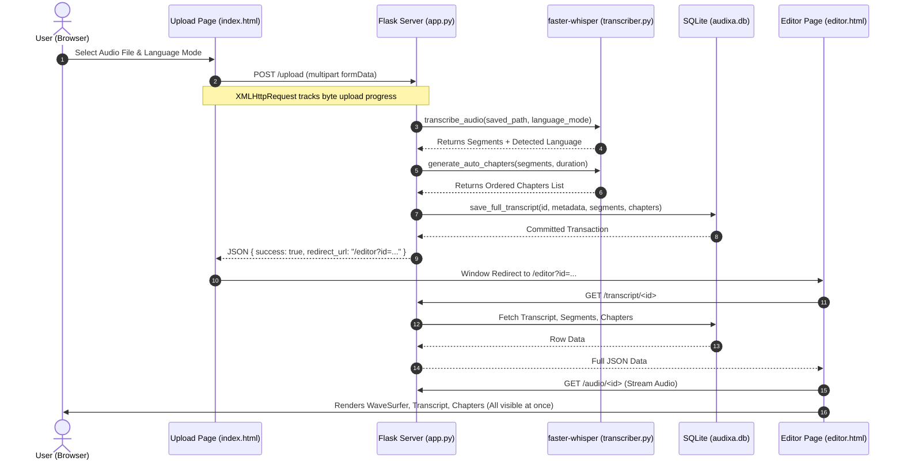

# Audixa: AI Audio Transcript & Chapter Maker
## Complete Project Documentation & Technical Specification

---

## 1. Project Overview

**Audixa** is a modern, lightweight, 2-page web application designed for automated speech-to-text transcription, synchronized playback scrubbing, live inline transcript editing, and intelligent chapter generation. Built with a **fundamentals-first** philosophy, Audixa uses standard Python (Flask + SQLite) and native Web technologies (HTML5, Vanilla CSS, Vanilla JavaScript) without heavy frontend frameworks, bundlers, or third-party paid API dependencies.

### Core Capabilities
- **Local AI Transcription**: Powered by `faster-whisper` (CTranslate2 implementation of OpenAI Whisper) running on CPU with 8-bit quantization.
- **Bilingual & Mixed Speech Support**: Native support for **English**, **Hindi**, and code-switched **Hinglish** (Hindi-English mixed speech).
- **Automated Chapter Generation**: Algorithmic detection of conversational pause-gaps ($\ge 1.5$s silence) combined with temporal clustering to structure recordings into chapters.
- **Simultaneous 3-Panel Editor Screen**: All three working sections (Audio Player/Waveform, Transcribed Text, and Chapter Maker) are visible on a single screen without tab-switching.
- **Real-Time Playback Synchronization**: Sub-second synchronization between audio position, active segment glow, auto-scrolling transcript, and active chapter indicator.
- **Multi-Format Exporter**: One-click exporting to `.txt` (Plain Text), `.srt` (SubRip Subtitles), `.vtt` (WebVTT), and `.json` (Full Data).

---

## 2. Technology Stack & Programming Languages

Audixa is intentionally built with low-overhead, transparent technologies that are easily explainable for academic presentations and viva defenses:

```
┌────────────────────────────────────────────────────────────────────────┐
│                        LANGUAGES & TECHNOLOGIES                        │
├───────────────────┬────────────────────────────────────────────────────┤
│ Language          │ Purpose / Layer                                    │
├───────────────────┼────────────────────────────────────────────────────┤
│ Python 3.10+      │ Backend server, database operations, AI pipeline   │
│ JavaScript (ES6+) │ Client-side sync engine, audio events, DOM updates │
│ HTML5             │ Semantic structure for 2 core pages                │
│ CSS3              │ Custom Warm Editorial Minimalist design system     │
│ SQL (SQLite3)     │ Relational schema, indices, atomic transactions    │
└───────────────────┴────────────────────────────────────────────────────┘
```

### Libraries & Frameworks Breakdown

| Technology | Type | Version / CDN | Purpose |
| :--- | :--- | :--- | :--- |
| **Flask** | Backend Framework | `^3.1.3` | Lightweight WSGI server serving HTML templates and REST JSON endpoints. |
| **faster-whisper** | AI Engine | `^1.2.1` | Highly optimized CTranslate2 Whisper engine (4x faster than vanilla Whisper, low RAM). |
| **sqlite3** | Database | Built-in Python stdlib | Serverless, zero-config relational database storing transcripts, segments, and chapters. |
| **Werkzeug** | Backend Utility | `^3.1.8` | Secure filename parsing, multipart streaming, and HTTP utilities. |
| **WaveSurfer.js** | Frontend Library | `v7` (CDN script) | Client-side interactive audio waveform visualizer and seek controller. |
| **Google Fonts** | Typography | Plus Jakarta Sans & JetBrains Mono | High-legibility UI typography and monospace timestamp styling. |

---

## 3. List of Supported Spoken Languages

Audixa provides three primary transcription modes designed for Indian and global audio contexts:

| Mode | Identifier | Spoken Language Details | Script Output |
| :--- | :--- | :--- | :--- |
| **Auto-detect (Hinglish / Mixed)** | `auto` *(Default)* | Mixed code-switched Hindi and English speech commonly spoken in podcasts, lectures, and interviews. Whisper automatically detects language shifts per segment. | Mixed Devanagari & Latin script (e.g., *"आज हम coding discuss करेंगे"*). |
| **English** | `en` | Standard English speech (Indian, US, UK, Global accents). | Latin script with accurate punctuation. |
| **Hindi** | `hi` | Standard spoken Hindi speech. | Devanagari script (e.g., *"नमस्ते, आज के इस वीडियो में आपका स्वागत है"*). |

### Whisper Model Precision Details
- **`tiny`**: Ultra-fast (~39M parameters), minimal memory footprint (<500MB RAM), ideal for quick testing.
- **`base`** *(Default)*: (~74M parameters), excellent balance of real-time speed and bilingual accuracy on standard CPUs.
- **`small`**: (~244M parameters), highest accuracy for complex code-switched Hinglish speech and background noise.

---

## 4. Complete Project Asset & File Inventory

```
Audixa/
├── app.py                      # Main Flask application and REST endpoints
├── db.py                       # SQLite database manager & CRUD operations
├── transcriber.py              # faster-whisper model pipeline & chapter heuristic
├── audixa.db                   # SQLite database file (auto-initialized)
├── requirements.txt            # Python dependencies
├── README.md                   # Quick-start documentation
├── PROJECT_DOCUMENTATION.md    # Exhaustive technical documentation
├── test_app.py                 # Automated unit and integration test suite
│
├── templates/                  # HTML5 Templates
│   ├── index.html              # Page 1: Upload & Language Selection Page
│   └── editor.html             # Page 2: Simultaneous 3-Panel Editor
│
├── static/                     # Static Web Assets
│   ├── css/
│   │   └── styles.css          # Warm Editorial Minimalist design system
│   └── js/
│       ├── upload.js           # Upload controller & progress tracking
│       └── editor.js           # Audio player sync, segment & chapter editing
│
└── uploads/                    # Media Storage Directory (.mp3, .wav, .mp4, etc.)
```

### Detailed File Descriptions

#### 1. `app.py`
- **Location**: [`Audixa/app.py`](file:///C:/Users/Daksh%20Rajput/.gemini/antigravity-ide/scratch/Audixa/app.py)
- **Role**: Entry point for the Flask web application.
- **Functions & Routes**:
  - `GET /`: Serves `index.html` (Upload page).
  - `GET /editor`: Serves `editor.html` (Editor page).
  - `POST /upload`: Validates multipart file, saves media to `uploads/`, executes Whisper transcription, generates chapters, persists records to SQLite, and returns JSON redirect payload.
  - `GET /transcript/<id>`: Returns full JSON payload containing metadata, ordered segments, and ordered chapters.
  - `POST /save_transcript/<id>`: Updates edited segment text atomically in SQLite.
  - `POST /save_chapters/<id>`: Updates, re-orders, and persists chapters in SQLite.
  - `GET /audio/<id>`: Streams media files with HTTP 206 Partial Content (byte-range) support for smooth player scrubbing.
  - `GET /api/health`: JSON health check endpoint.

#### 2. `db.py`
- **Location**: [`Audixa/db.py`](file:///C:/Users/Daksh%20Rajput/.gemini/antigravity-ide/scratch/Audixa/db.py)
- **Role**: Database access layer managing the SQLite database (`audixa.db`).
- **Key Functions**:
  - `init_db()`: Creates `transcripts`, `segments`, and `chapters` tables and indices.
  - `save_full_transcript(...)`: Inserts transcript header, segments, and chapters in a single transaction.
  - `get_transcript_by_id(transcript_id)`: Fetches transcript metadata joined with ordered segments and chapters.
  - `save_transcript_segments(transcript_id, segments)`: Replaces/updates segments for a transcript.
  - `save_chapters(transcript_id, chapters)`: Sorts and updates chapters by `start_time`.
  - `delete_transcript_record(transcript_id)`: Deletes database rows with cascading foreign keys.

#### 3. `transcriber.py`
- **Location**: [`Audixa/transcriber.py`](file:///C:/Users/Daksh%20Rajput/.gemini/antigravity-ide/scratch/Audixa/transcriber.py)
- **Role**: Wrapper around `faster-whisper` and smart auto-chapter heuristics.
- **Key Functions**:
  - `get_whisper_model(model_size)`: Singleton caching for the Whisper neural network on CPU with `int8` quantization.
  - `transcribe_audio(file_path, language_mode, model_size)`: Runs beam-search speech recognition, VAD (voice activity detection) filtering, and word timestamp alignment.
  - `generate_auto_chapters(segments, total_duration)`: Analyzes conversational pause gaps ($\ge 1.5$s silence between segments) and time clusters (every 30–60s) to create chapter markers with meaningful title previews.

#### 4. `templates/index.html` (Page 1)
- **Location**: [`Audixa/templates/index.html`](file:///C:/Users/Daksh%20Rajput/.gemini/antigravity-ide/scratch/Audixa/templates/index.html)
- **Role**: Page 1 of the application.
- **Components**:
  - Clean navbar with Audixa branding.
  - Hero header: *"Transform Speech into Structured Transcripts & Chapters"*.
  - Interactive drag-and-drop upload zone supporting `.mp3`, `.wav`, `.m4a`, `.mp4`, `.flac`, `.aac`, `.ogg`.
  - Speech language dropdown selector (Auto-detect Hinglish, English, Hindi).
  - Submit button triggering real-time progress bar.
  - Animated soundwave equalizer overlay during Whisper AI processing with elapsed timer.

#### 5. `templates/editor.html` (Page 2)
- **Location**: [`Audixa/templates/editor.html`](file:///C:/Users/Daksh%20Rajput/.gemini/antigravity-ide/scratch/Audixa/templates/editor.html)
- **Role**: Page 2 of the application — Simultaneous 3-Panel Screen.
- **Components**:
  - **Top Bar**: File title, language badge, duration badge, and Export dropdown menu.
  - **Section A (Top Left)**: Interactive WaveSurfer audio visualizer, current/total time display, play/pause, $\pm 5$s skip, playback speed ($0.75\times - 2.0\times$), and volume slider.
  - **Section B (Right Panel)**: Scrollable interactive transcript with timestamp chips, real-time active segment glow, auto-scroll, click-to-seek, search bar with match counter, and inline auto-saving textareas.
  - **Section C (Bottom Left)**: Chapter Maker with chapter count, **"+ Add Chapter at current time"** button, inline title and timestamp editors, chapter deletion, and active chapter playback highlight.

#### 6. `static/css/styles.css`
- **Location**: [`Audixa/static/css/styles.css`](file:///C:/Users/Daksh%20Rajput/.gemini/antigravity-ide/scratch/Audixa/static/css/styles.css)
- **Role**: Comprehensive Warm Editorial Minimalist design system.
- **Color Palette Tokens**:
  - Porcelain Off-White (`#F5F5F5` / `#FFFFFF`): Headings & high-contrast typography.
  - Warm Cream / Linen (`#EAE4D6` / `#F4EFE6`): Primary buttons, active segment glows, and waveform progress.
  - Muted Warm Stone / Taupe (`#B4ADA2` / `#8C857A`): Borders, secondary badges, and waveform background.
  - Obsidian Black (`#000000` / `#0A0A0A` / `#121212`): Base backgrounds and dark panel surfaces.

#### 7. `static/js/upload.js`
- **Location**: [`Audixa/static/js/upload.js`](file:///C:/Users/Daksh%20Rajput/.gemini/antigravity-ide/scratch/Audixa/static/js/upload.js)
- **Role**: Handles client-side drag-and-drop, `XMLHttpRequest` upload with byte progress calculation, processing animations, and seamless redirection to `/editor?id=...`.

#### 8. `static/js/editor.js`
- **Location**: [`Audixa/static/js/editor.js`](file:///C:/Users/Daksh%20Rajput/.gemini/antigravity-ide/scratch/Audixa/static/js/editor.js)
- **Role**: Unified event-driven synchronization engine:
  - Initializes WaveSurfer waveform and HTML5 audio backend.
  - Connects playback `timeupdate` to segment cards (`scrollIntoView`) and chapter cards.
  - Manages inline transcript editing with debounced auto-save (`POST /save_transcript/<id>`).
  - Manages chapter addition, editing, sorting, and persistence (`POST /save_chapters/<id>`).
  - Implements keyboard shortcuts (Space for Play/Pause, Arrow keys / J/L for seeking).
  - Handles client-side multi-format exports (TXT, SRT, VTT, JSON).

#### 9. `test_app.py`
- **Location**: [`Audixa/test_app.py`](file:///C:/Users/Daksh%20Rajput/.gemini/antigravity-ide/scratch/Audixa/test_app.py)
- **Role**: Automated Python `unittest` suite covering database CRUD, HTML route serving, REST JSON endpoints, and real audio transcription on test media.

---

## 5. System Architecture & Data Flow



---

## 6. Database Schema (`audixa.db`)

Audixa uses a relational 3-table SQLite schema with foreign keys and index optimization:

```sql
-- 1. Transcripts Master Table
CREATE TABLE IF NOT EXISTS transcripts (
    id TEXT PRIMARY KEY,
    filename TEXT NOT NULL,
    original_name TEXT NOT NULL,
    language_mode TEXT NOT NULL,
    detected_language TEXT,
    duration REAL DEFAULT 0.0,
    model_size TEXT DEFAULT 'base',
    created_at TIMESTAMP DEFAULT CURRENT_TIMESTAMP
);

-- 2. Segments Detail Table
CREATE TABLE IF NOT EXISTS segments (
    id TEXT PRIMARY KEY,
    transcript_id TEXT NOT NULL,
    start_time REAL NOT NULL,
    end_time REAL NOT NULL,
    text TEXT NOT NULL,
    order_index INTEGER NOT NULL,
    FOREIGN KEY (transcript_id) REFERENCES transcripts (id) ON DELETE CASCADE
);

-- 3. Chapters Detail Table
CREATE TABLE IF NOT EXISTS chapters (
    id TEXT PRIMARY KEY,
    transcript_id TEXT NOT NULL,
    title TEXT NOT NULL,
    start_time REAL NOT NULL,
    end_time REAL NOT NULL,
    order_index INTEGER NOT NULL,
    FOREIGN KEY (transcript_id) REFERENCES transcripts (id) ON DELETE CASCADE
);

-- Performance Indices
CREATE INDEX IF NOT EXISTS idx_segments_transcript ON segments (transcript_id, order_index);
CREATE INDEX IF NOT EXISTS idx_chapters_transcript ON chapters (transcript_id, start_time);
```

---

## 7. REST API Endpoints Specification

### 1. `POST /upload`
- **Description**: Uploads audio/video file and runs Whisper transcription and chaptering.
- **Content-Type**: `multipart/form-data`
- **Parameters**: `file` (Binary), `language_mode` (`"auto" | "en" | "hi"`), `model_size` (`"base"`).
- **Response**:
```json
{
  "success": true,
  "id": "audixa_9af57dbc1d",
  "filename": "lecture_recording.mp3",
  "redirect_url": "/editor?id=audixa_9af57dbc1d",
  "metadata": {
    "detected_language": "hi",
    "language_probability": 0.985,
    "duration": 184.5,
    "model_size": "base"
  },
  "segments_count": 28,
  "chapters_count": 4
}
```

### 2. `GET /transcript/<transcript_id>`
- **Description**: Retrieves full transcript metadata, time-aligned segments, and chapters.
- **Response**:
```json
{
  "success": true,
  "data": {
    "id": "audixa_9af57dbc1d",
    "original_name": "lecture_recording.mp3",
    "language_mode": "auto",
    "detected_language": "hi",
    "duration": 184.5,
    "audio_url": "/audio/audixa_9af57dbc1d",
    "segments": [
      {
        "id": "seg_01",
        "start_time": 0.0,
        "end_time": 4.5,
        "text": "Hello everyone, आज हम डेटा स्ट्रक्चर्स शुरू करेंगे।",
        "order_index": 0
      }
    ],
    "chapters": [
      {
        "id": "ch_01",
        "title": "Introduction",
        "start_time": 0.0,
        "end_time": 45.0,
        "order_index": 0
      }
    ]
  }
}
```

### 3. `POST /save_transcript/<transcript_id>`
- **Description**: Updates edited transcript segment text.
- **Body**: `{"segments": [{"id": "seg_01", "start_time": 0.0, "end_time": 4.5, "text": "Updated text"}]}`
- **Response**: `{"success": true, "message": "Transcript saved successfully"}`

### 4. `POST /save_chapters/<transcript_id>`
- **Description**: Updates, re-orders, and saves chapters.
- **Body**: `{"chapters": [{"id": "ch_01", "title": "New Title", "start_time": 0.0, "end_time": 45.0}]}`
- **Response**: `{"success": true, "message": "Chapters saved successfully", "chapters": [...]}`

### 5. `GET /audio/<transcript_id>`
- **Description**: Streams audio/video file with HTTP 206 Byte Range support.

---

## 8. Installation, Setup & Execution Guide

### Prerequisites
- Python 3.10, 3.11, 3.12, or 3.13 installed.

### Setup Steps

```bash
# 1. Navigate to the project root directory
cd "C:\Users\Daksh Rajput\.gemini\antigravity-ide\scratch\Audixa"

# 2. Activate the Python Virtual Environment
# On Windows (PowerShell):
.\backend\venv\Scripts\Activate.ps1
# On Linux/macOS:
source backend/venv/bin/activate

# 3. Install dependencies (if setting up fresh)
pip install -r requirements.txt

# 4. Run automated test suite to verify pipeline
python test_app.py

# 5. Launch the Audixa Web Server
python app.py
```

### Accessing the Web Application
Open your browser and navigate to:
👉 **`http://127.0.0.1:5000`**

---

## 9. Academic Viva & Defense Q&A Cheatsheet

### Q1: Why use Flask instead of FastAPI or Django?
> **Answer**: Flask is a lightweight microframework that directly renders HTML templates while simultaneously exposing clean REST endpoints. It avoids the heavy ORM configuration of Django and the extra frontend server separation of FastAPI, keeping the architecture clear, self-contained, and easy to explain during academic evaluation.

### Q2: Why use `faster-whisper` instead of standard `openai-whisper` or cloud APIs?
> **Answer**: `faster-whisper` is built on CTranslate2, which uses integer quantization (`int8`) on CPU. It executes up to 4 times faster than standard PyTorch Whisper while consuming less than 1GB of RAM. It runs 100% locally and free, eliminating dependencies on external paid API keys or cloud internet bandwidth.

### Q3: How does the application handle Hinglish (Hindi-English mixed) audio?
> **Answer**: By passing `language=None` (Auto-detect mode) into Whisper, the neural model's multilingual tokenizer identifies language shifts across phonetic tokens. It naturally produces mixed-language output (Devanagari for Hindi words and Latin alphabet for English terms) without needing external translation layers.

### Q4: How does the Chapter Generation heuristic work?
> **Answer**: Rather than relying on arbitrary fixed intervals, Audixa detects conversational pause-gaps ($\ge 1.5$s silence between speech segments) and clusters related segments into topical blocks (typically 30–60s). It automatically extracts the opening phrase of each block to generate contextual chapter titles.

### Q5: How is playback synchronized across the 3 simultaneous panels?
> **Answer**: The HTML5 audio / WaveSurfer `timeupdate` event fires multiple times per second. Audixa’s event listener queries the segment and chapter arrays for the current timestamp $t$, applies the `.active` CSS glowing indicator to matching cards, and invokes `scrollIntoView({ behavior: 'smooth', block: 'nearest' })` on the active segment.
